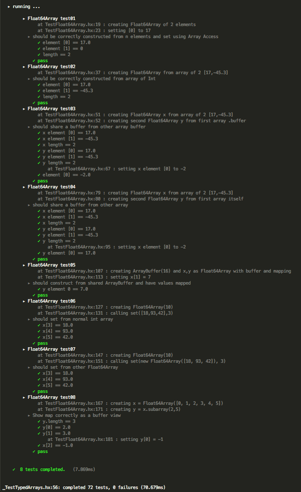
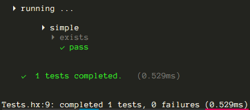

### mohxa is a testing library for [Haxe](http://haxe.org/)
---
A BDD style test library based closely on http://visionmedia.github.io/mocha/

(still pronounced mocha)

###Features
---

- nested test groups
- before, after, beforeEach, afterEach per group
- formatted logging from inside tests
- `equal`,`notequal`,`equalfloat`,`equalint` helper

**todo**    

- async
- other output formats (json etc).

**note**   
Usually -debug flag is required for Stack traces.

### Install options

`haxelib install mohxa`   
`haxelib git mohxa https://github.com/underscorediscovery/mohxa.git`    
`haxelib local mohxa /path/to/mohxa-1.1.0.zip` (from releases)   

---

###How does it look?

```haxe
import structural.Stack;

class StackTest extends Mohxa {

    public function new() {

        super();

        describe('Stack Test', function(){

            log('we will create 2 different stacks');
            log('one with ints, one with strings');

            var int_stack : Stack<Int>;
            var string_stack : Stack<String>;

            before(function(){

                log('creating ... ');

                int_stack = new Stack<Int>();
                string_stack = new Stack<String>();

            });

            it('should each start with a 0 length', function(){
                equal(int_stack.length, 0, 'int stack');
                equal(string_stack.length, 0, 'string stack');
            });

            ...

        }); //Stack Test

    } //new

} //StackTest
```

### How does the output look?




### mohxa.Run

Often times it is convenient to split test instances into groups.
A Run is a group of test instances, which runs the group,
and collates the `total`, `failed` and `time` properties from the run.

```haxe

class Simple extends mohxa.Mohxa {

    public function new() {
        super();

        describe('simple', function() {
            it('exists', function() {
                equal(true, true);
            });
        });

    } //new

} //Simple

static function main() {

    var run = new mohxa.Run([ new Simple() ]);

    trace('completed ${run.total} tests, ${run.failed} failures (${run.time}ms)');

} //main

```

You can also pass `false` to the constructor and call `run` manually.



---

### History
- 1.1.0 - Added mohxa.Run, for conveniently running groups of test instances, added mohxa_no_generic
- 1.0.2 - lots MORE code clean up, update readme, tested on other targets. somewhere tags were added...    
- 1.0.1 - lots of code clean up, remove Dynamic use where not needed, replace with @:generic   
- 1.0.0 - Initial release

### That's it

- Suggestions, issues, bugs welcome.

